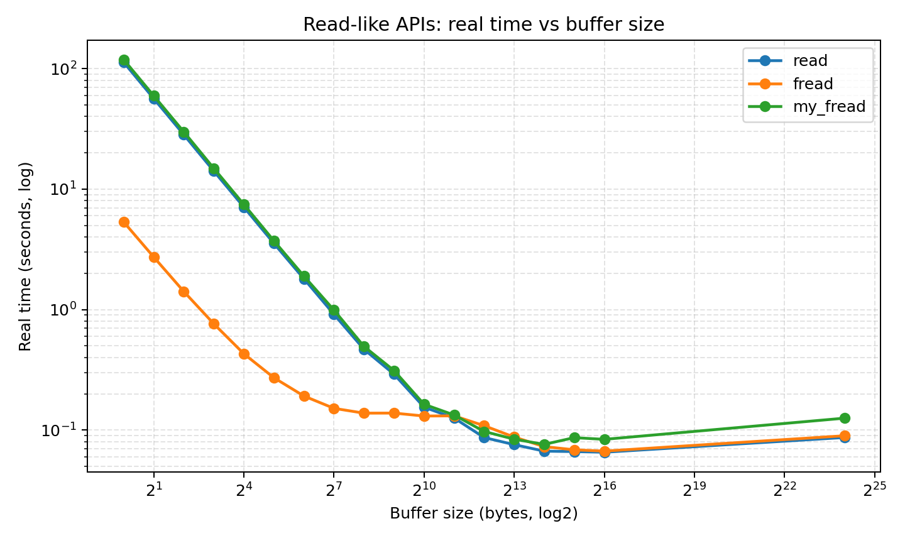
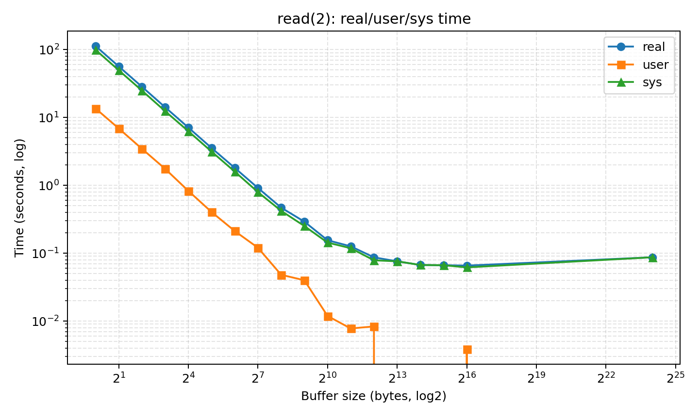
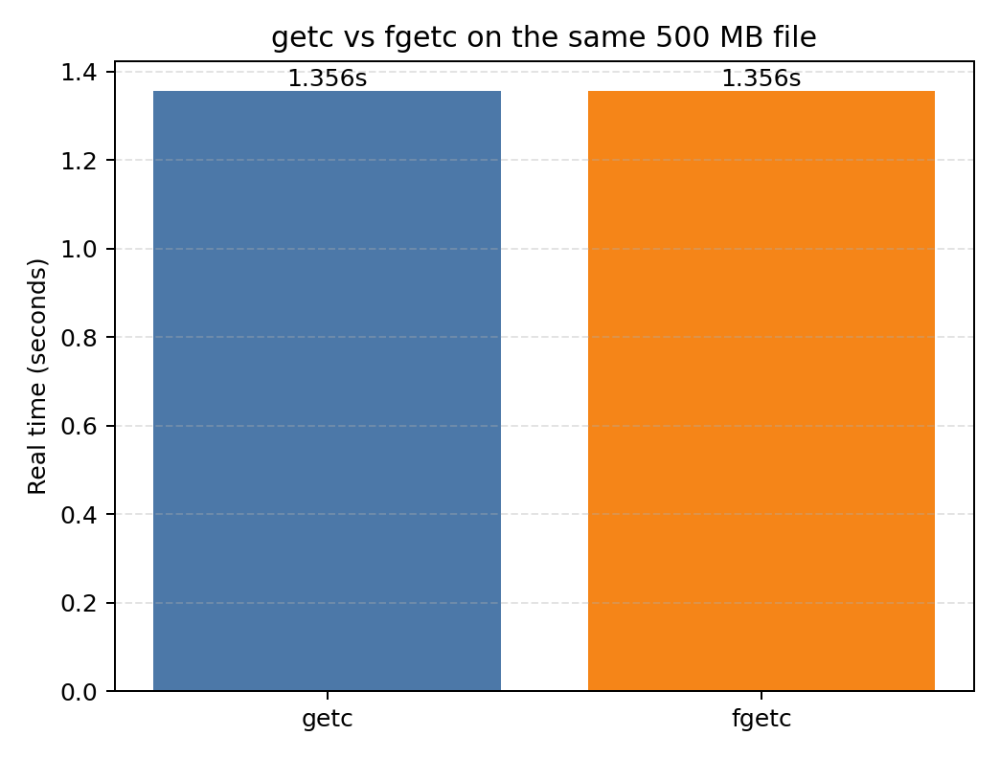
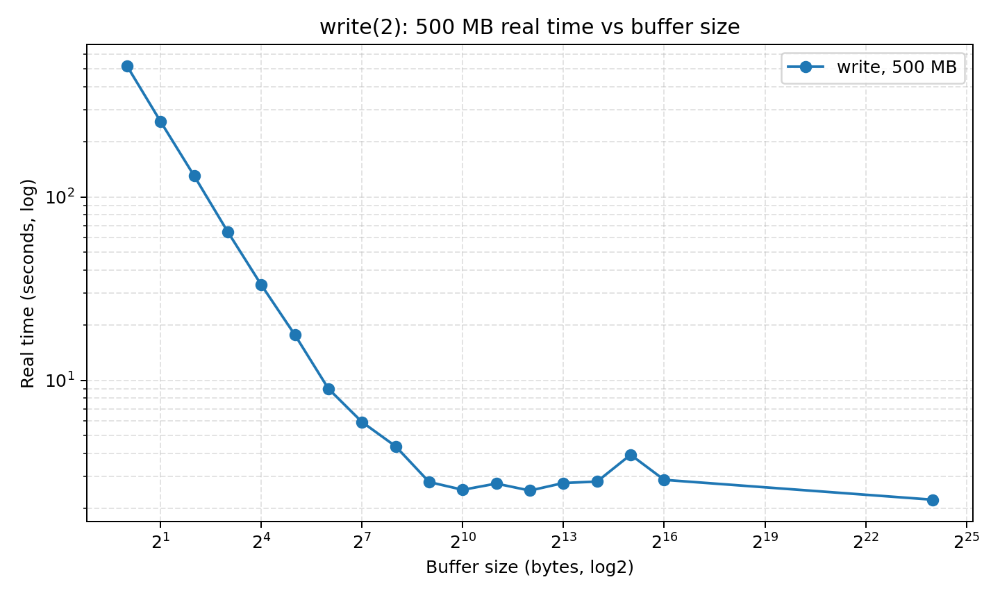
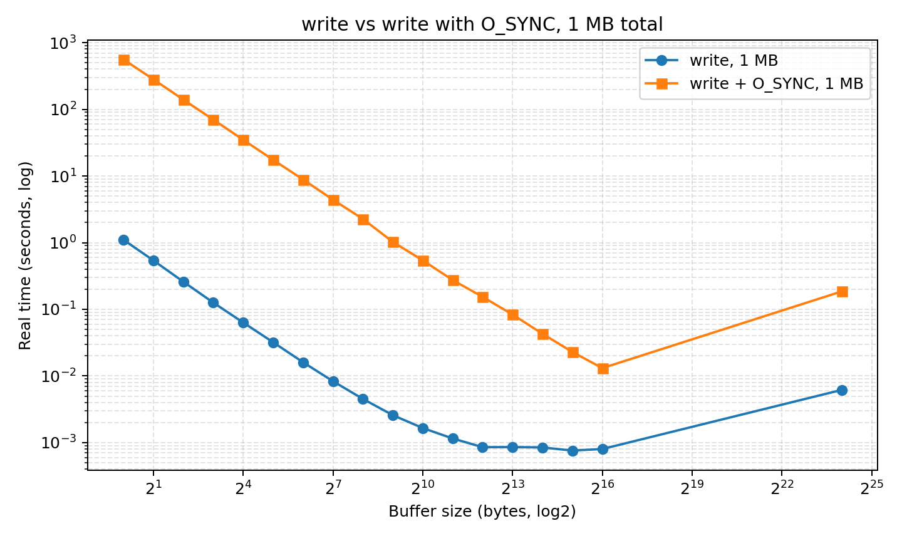

# Part A UNIX I/O 基础性能对比实验报告

## 1. 实验目的

本实验测量 UNIX/Linux 下多种 I/O 接口在顺序读写场景中的性能差异，重点观察系统调用次数、用户态缓冲、内核页缓存以及同步写语义对 real/user/sys 时间的影响。实验覆盖 `read()`、`getc()`、`fgetc()`、`fread()`、自实现 `my_fread()`、普通 `write()` 和带 `O_SYNC` 的 `write()`。

## 2. 实验环境

| 项目 | 信息 |
| --- | --- |
| 操作系统 | Ubuntu 20.04.6 LTS |
| 内核 | `Linux rdma221 5.4.0-26-generic #30-Ubuntu SMP Mon Apr 20 16:58:30 UTC 2020 x86_64 x86_64 x86_64 GNU/Linux` |
| CPU | Intel(R) Xeon(R) Silver 4314 CPU @ 2.40GHz，64 logical CPUs |
| 内存 | `Mem:          251Gi       110Gi       134Gi       2.0Mi       6.0Gi       138Gi` |
| 文件系统 | `/dev/mapper/ubuntu--vg-ubuntu--lv ext4 1880200276 1225559920 568832300  69% /` |
| 磁盘 | 服务器存在 SSD/NVMe 设备，`lsblk` 显示 `ROTA=0`，包括 `WDC_WDS100T2G0A-` 与 `Dell DC NVMe PE8010 RI U.2 960GB` |

环境信息原始输出保存在 `results/env/` 目录下。实验结果 CSV 保存在 `results/` 目录下。

## 3. 实验方法

### 3.1 计时方法

测试程序使用 `clock_gettime(CLOCK_MONOTONIC)` 记录 wall clock time，也就是报告中的 `real_sec`；使用 `getrusage(RUSAGE_SELF)` 记录用户态 CPU 时间 `user_sec` 和内核态 CPU 时间 `sys_sec`。每次测试均输出 CSV：

```text
method,bufsize,bytes,real_sec,user_sec,sys_sec
```

本实验结果为服务器上的一次完整运行。由于 UNIX/Linux 文件 I/O 会受到 page cache、后台写回和系统负载影响，报告重点分析不同接口和 BUFFSIZE 的数量级趋势，而不是把某个单点时间视为硬件绝对性能。

### 3.2 缓冲区大小

按照实验要求，使用以下 BUFFSIZE：

```text
1, 2, 4, 8, 16, 32, 64, 128, 256, 512,
1024, 2048, 4096, 8192, 16384, 32768,
65536, 16777216
```

### 3.3 读实验

读实验使用 500 MB 测试文件，命令为：

```sh
./io_bench all_read testfile.bin > ../results/partA_all_read.csv
```

其中 `read`、`fread`、`my_fread` 对所有 BUFFSIZE 进行测试；`getc` 与 `fgetc` 是逐字符接口，因此各测试一次。

### 3.4 写实验

普通 `write` 首先进行了 500 MB 完整测试：

```sh
./io_bench all_write out.bin 524288000 > ../results/partA_all_write.csv
```

该文件中保留的是普通 `write` 的完整结果。由于 `O_SYNC` 在极小 BUFFSIZE 下会产生大量同步写路径，500 MB 的 `write_sync,bufsize=1` 会带来不可接受的运行时间，因此同步写对比采用 64 KB 和 1 MB 两组较小总写入量，保持相同 BUFFSIZE 序列：

```sh
./io_bench write out_1MB.bin 1048576 > ../results/partA_write_1MB.csv
./io_bench write_sync out_sync_1MB.bin 1048576 > ../results/partA_write_sync_1MB.csv
```

这样设计可以保证 `write` 与 `O_SYNC write` 在相同写入总量下比较，同时避免小缓冲同步写将实验时间放大到数小时。

## 4. 实验结果

### 4.1 read / fread / my_fread 趋势



`read()` 在 `bufsize=1` 时 real time 为 112.720405 s；当 BUFFSIZE 增大到 65536 字节时，real time 降至 0.065621 s。`fread()` 最优 real time 为 0.067050 s，出现在 BUFFSIZE=65536；`my_fread()` 最优 real time 为 0.076267 s，出现在 BUFFSIZE=16384。



从 `read()` 的 real/user/sys 分解可以看到，小 BUFFSIZE 时 `sys_sec` 占主导。这说明性能瓶颈主要来自频繁进入内核的系统调用开销，而不是用户态计算。随着 BUFFSIZE 增大，系统调用次数近似按比例下降，`sys_sec` 和 real time 也快速下降。到 16 KB 到 64 KB 附近后，继续增大缓冲区收益有限，说明此时已经接近顺序读取和页缓存路径的稳定吞吐区间。

### 4.2 getc 与 fgetc



`getc()` 与 `fgetc()` 都是逐字符接口，但它们并不等价于每字节调用一次 `read()`。标准 I/O 库内部维护用户态缓冲区，底层会批量从内核读取数据，然后在用户态逐字符返回。因此二者读取 500 MB 文件均约为 1.36 s，远快于 `read(bufsize=1)` 的 112.72 s。

本次实验中 `getc()` 和 `fgetc()` 的 real time 非常接近，说明在当前编译器、libc 和优化条件下，宏形式或函数形式带来的差异不是主导因素。它们相比块读取仍然更慢，主要因为每个字符仍需要经过 stdio 的状态检查和接口调用路径。

### 4.3 fread 与 my_fread

`fread()` 和 `my_fread()` 都体现了用户态缓冲减少系统调用次数的价值。`my_fread()` 内部使用 `read()` 补充缓冲区，再从用户态缓冲区向调用者拷贝数据。其趋势与 `fread()` 基本一致：小 BUFFSIZE 下系统调用次数多，性能较差；中等 BUFFSIZE 后进入平台吞吐上限。

`fread()` 的最优结果略好于 `my_fread()`，原因可能包括：标准库实现经过高度优化；stdio 缓冲、内部拷贝和分支处理更成熟；而本实验中的 `my_fread()` 是教学目的的简化实现，主要用于验证缓冲思想，而非替代 libc。

### 4.4 普通 write



普通 `write()` 的 500 MB 实验中，`bufsize=1` 的 real time 为 519.885968 s；最优结果为 2.231312 s，出现在 BUFFSIZE=16777216。趋势与 `read()` 类似：极小 BUFFSIZE 导致系统调用次数巨大，例如 500 MB / 1 byte 约为 5.24 亿次 `write()` 调用，因此 `sys_sec` 和 real time 都非常高。

当 BUFFSIZE 增大到 KB 级以后，系统调用次数大幅减少，普通 `write()` 的耗时降到几秒级。普通写不会要求每次调用都同步落盘，数据通常先进入内核页缓存，之后由内核异步写回存储设备，因此大缓冲下的 real time 主要反映进入页缓存和文件系统路径的成本，而不是每次真实落盘延迟。

### 4.5 write 与 O_SYNC write



1 MB 对比实验中，普通 `write(bufsize=1)` real time 为 1.105486 s，而 `write_sync(bufsize=1)` real time 为 560.828087 s。`O_SYNC` 要求写操作具备同步语义，小缓冲区下相当于把大量细碎写入逐次推入更重的同步路径，因此时间急剧上升。

当 BUFFSIZE 增大时，`O_SYNC` 的耗时快速下降。`write_sync` 的最优结果为 0.013124 s，出现在 BUFFSIZE=65536。这说明 `O_SYNC` 的主要代价不是简单的用户态函数调用，而是同步提交次数。把多个字节合并进一次较大的 `write()` 可以显著减少同步操作次数。

## 5. 原理分析与讨论

### 5.1 系统调用次数

系统调用需要从用户态切换到内核态，进行参数检查、文件描述符查找、VFS/文件系统路径处理以及数据拷贝等工作。对于 500 MB 文件，`bufsize=1` 会产生数亿次系统调用，因此时间几乎完全被系统调用开销吞噬。BUFFSIZE 每翻倍，理论上的系统调用次数约减半，实验中小缓冲区阶段的 real time 也呈现近似减半趋势。

### 5.2 内核页缓存

普通 `read()` 和 `write()` 都会经过内核页缓存。顺序读时，如果数据已经在页缓存中，读取可以主要在内存路径完成；顺序写时，普通 `write()` 通常先把数据写入页缓存并标记脏页，随后由内核异步回写。页缓存使得普通写在大缓冲区下看起来非常快，但这并不代表数据已经全部持久化到设备。

### 5.3 用户态缓冲

stdio 的 `getc/fgetc/fread` 使用用户态缓冲区，能够减少底层 `read()` 系统调用次数。逐字符的 `getc/fgetc` 虽然 API 上每次返回一个字符，但大多数调用只在用户态缓冲区移动指针，只有缓冲区耗尽时才进入内核补充数据。因此它们明显快于 `read(bufsize=1)`。

### 5.4 O_SYNC

`O_SYNC` 改变了写入语义：调用返回前需要满足更强的同步要求。小 BUFFSIZE 下，`O_SYNC` 会把每个小块写入都变成昂贵的同步操作，性能显著下降。实验中 `write_sync(bufsize=1)` 的时间远高于普通 `write(bufsize=1)`，正说明同步写的主导成本在内核和存储路径，而非用户态循环。

### 5.5 BUFFSIZE 的收益递减

从读写实验都可以看到，BUFFSIZE 从 1 增大到 4 KB、16 KB、64 KB 时收益巨大；但继续增大到 16 MB 后并不一定更快，甚至可能变慢。这是因为系统调用次数已经足够少，新的瓶颈转移到页缓存、内存带宽、文件系统路径、缓存局部性以及大块内存分配/拷贝等因素。

## 6. 结论

1. 小 BUFFSIZE 下，系统调用次数是 UNIX I/O 性能的主要瓶颈。
2. stdio 的用户态缓冲使逐字符 `getc/fgetc` 远快于逐字节 `read()`。
3. `fread()` 与自实现 `my_fread()` 的趋势一致，证明用户态缓冲能显著减少系统调用开销；标准库实现整体更成熟。
4. 普通 `write()` 受益于内核页缓存，大缓冲区下耗时显著下降。
5. `O_SYNC` 会显著放大同步写成本，尤其在极小 BUFFSIZE 下表现最明显。
6. BUFFSIZE 并非越大越好，达到 KB 到几十 KB 级别后通常进入收益递减区间。

## 附录 A：关键实验数据

### A.1 读实验完整数据

| method | bufsize | bytes | real_sec | user_sec | sys_sec |
| --- | --- | --- | --- | --- | --- |
| read | 1 | 524288000 | 112.720404806 | 13.555514000 | 99.162456000 |
| read | 2 | 524288000 | 56.389497211 | 6.876000000 | 49.512025000 |
| read | 4 | 524288000 | 28.304439677 | 3.451965000 | 24.851755000 |
| read | 8 | 524288000 | 14.111344204 | 1.747858000 | 12.362964000 |
| read | 16 | 524288000 | 7.093440168 | 0.827666000 | 6.265567000 |
| read | 32 | 524288000 | 3.545143825 | 0.404121000 | 3.140884000 |
| read | 64 | 524288000 | 1.803606274 | 0.211946000 | 1.591594000 |
| read | 128 | 524288000 | 0.914014291 | 0.120238000 | 0.793743000 |
| read | 256 | 524288000 | 0.468600205 | 0.048072000 | 0.420514000 |
| read | 512 | 524288000 | 0.291269934 | 0.039911000 | 0.251353000 |
| read | 1024 | 524288000 | 0.155121254 | 0.011892000 | 0.143216000 |
| read | 2048 | 524288000 | 0.126117431 | 0.007773000 | 0.118344000 |
| read | 4096 | 524288000 | 0.086841204 | 0.008340000 | 0.078501000 |
| read | 8192 | 524288000 | 0.075882203 | 0.000000000 | 0.075882000 |
| read | 16384 | 524288000 | 0.067002434 | 0.000000000 | 0.067002000 |
| read | 32768 | 524288000 | 0.066449963 | 0.000000000 | 0.066441000 |
| read | 65536 | 524288000 | 0.065621356 | 0.003881000 | 0.061739000 |
| read | 16777216 | 524288000 | 0.087000646 | 0.000000000 | 0.087001000 |
| getc | 1 | 524288000 | 1.356018844 | 1.267840000 | 0.088105000 |
| fgetc | 1 | 524288000 | 1.355903263 | 1.295943000 | 0.059892000 |
| fread | 1 | 524288000 | 5.335791562 | 5.267792000 | 0.067823000 |
| fread | 2 | 524288000 | 2.731404520 | 2.651813000 | 0.079467000 |
| fread | 4 | 524288000 | 1.415655584 | 1.355897000 | 0.059727000 |
| fread | 8 | 524288000 | 0.762941822 | 0.692459000 | 0.070424000 |
| fread | 16 | 524288000 | 0.430461690 | 0.383731000 | 0.046728000 |
| fread | 32 | 524288000 | 0.272451059 | 0.184073000 | 0.088375000 |
| fread | 64 | 524288000 | 0.192068938 | 0.108009000 | 0.084059000 |
| fread | 128 | 524288000 | 0.151792860 | 0.063962000 | 0.087830000 |
| fread | 256 | 524288000 | 0.138465843 | 0.043731000 | 0.094674000 |
| fread | 512 | 524288000 | 0.138612795 | 0.024441000 | 0.114172000 |
| fread | 1024 | 524288000 | 0.131075306 | 0.027842000 | 0.103233000 |
| fread | 2048 | 524288000 | 0.131526761 | 0.019922000 | 0.111604000 |
| fread | 4096 | 524288000 | 0.108925090 | 0.000156000 | 0.108768000 |
| fread | 8192 | 524288000 | 0.087679461 | 0.003942000 | 0.083718000 |
| fread | 16384 | 524288000 | 0.073081164 | 0.000183000 | 0.072880000 |
| fread | 32768 | 524288000 | 0.068745456 | 0.003450000 | 0.065295000 |
| fread | 65536 | 524288000 | 0.067049644 | 0.000515000 | 0.066535000 |
| fread | 16777216 | 524288000 | 0.089926162 | 0.000000000 | 0.089927000 |
| my_fread | 1 | 524288000 | 118.695358517 | 19.335005000 | 99.357018000 |
| my_fread | 2 | 524288000 | 59.509368804 | 9.587921000 | 49.919550000 |
| my_fread | 4 | 524288000 | 29.901451628 | 4.644084000 | 25.256383000 |
| my_fread | 8 | 524288000 | 14.871535754 | 2.535842000 | 12.335201000 |
| my_fread | 16 | 524288000 | 7.462318132 | 1.179665000 | 6.282331000 |
| my_fread | 32 | 524288000 | 3.728229769 | 0.592021000 | 3.136102000 |
| my_fread | 64 | 524288000 | 1.897971118 | 0.396321000 | 1.501607000 |
| my_fread | 128 | 524288000 | 0.991997430 | 0.171992000 | 0.819948000 |
| my_fread | 256 | 524288000 | 0.495168826 | 0.107852000 | 0.387298000 |
| my_fread | 512 | 524288000 | 0.312315114 | 0.052046000 | 0.260233000 |
| my_fread | 1024 | 524288000 | 0.163978310 | 0.031999000 | 0.131978000 |
| my_fread | 2048 | 524288000 | 0.133683499 | 0.007618000 | 0.126052000 |
| my_fread | 4096 | 524288000 | 0.097558979 | 0.012253000 | 0.085305000 |
| my_fread | 8192 | 524288000 | 0.084199241 | 0.004031000 | 0.080151000 |
| my_fread | 16384 | 524288000 | 0.076267377 | 0.008049000 | 0.068218000 |
| my_fread | 32768 | 524288000 | 0.086734105 | 0.003789000 | 0.082938000 |
| my_fread | 65536 | 524288000 | 0.083940940 | 0.035988000 | 0.047938000 |
| my_fread | 16777216 | 524288000 | 0.125833277 | 0.036298000 | 0.089535000 |

### A.2 500 MB 普通 write 数据

| method | bufsize | bytes | real_sec | user_sec | sys_sec |
| --- | --- | --- | --- | --- | --- |
| write | 1 | 524288000 | 519.885967747 | 28.398364000 | 491.344692000 |
| write | 2 | 524288000 | 258.583792954 | 14.599576000 | 243.874502000 |
| write | 4 | 524288000 | 130.718166487 | 7.192194000 | 123.458445000 |
| write | 8 | 524288000 | 64.723740936 | 3.499749000 | 61.135711000 |
| write | 16 | 524288000 | 33.183752240 | 1.852301000 | 31.037260000 |
| write | 32 | 524288000 | 17.716469774 | 0.899073000 | 15.700131000 |
| write | 64 | 524288000 | 8.998365823 | 0.444114000 | 8.042532000 |
| write | 128 | 524288000 | 5.922991821 | 0.194580000 | 4.307318000 |
| write | 256 | 524288000 | 4.366783467 | 0.095779000 | 2.479726000 |
| write | 512 | 524288000 | 2.786437944 | 0.055629000 | 1.350041000 |
| write | 1024 | 524288000 | 2.527278499 | 0.031823000 | 0.868847000 |
| write | 2048 | 524288000 | 2.733176340 | 0.005125000 | 0.650786000 |
| write | 4096 | 524288000 | 2.502849182 | 0.026952000 | 0.494828000 |
| write | 8192 | 524288000 | 2.752774579 | 0.000000000 | 0.514676000 |
| write | 16384 | 524288000 | 2.802268817 | 0.007150000 | 0.525769000 |
| write | 32768 | 524288000 | 3.925510260 | 0.000373000 | 0.486582000 |
| write | 65536 | 524288000 | 2.863584769 | 0.000433000 | 0.503786000 |
| write | 16777216 | 524288000 | 2.231312151 | 0.001910000 | 0.520035000 |

### A.3 1 MB 普通 write 数据

| method | bufsize | bytes | real_sec | user_sec | sys_sec |
| --- | --- | --- | --- | --- | --- |
| write | 1 | 1048576 | 1.105486069 | 0.066258000 | 1.039201000 |
| write | 2 | 1048576 | 0.540919021 | 0.015797000 | 0.524927000 |
| write | 4 | 1048576 | 0.259633752 | 0.007970000 | 0.251427000 |
| write | 8 | 1048576 | 0.126141486 | 0.004090000 | 0.121824000 |
| write | 16 | 1048576 | 0.063368908 | 0.003959000 | 0.059174000 |
| write | 32 | 1048576 | 0.032080395 | 0.011996000 | 0.019855000 |
| write | 64 | 1048576 | 0.016067086 | 0.000000000 | 0.015845000 |
| write | 128 | 1048576 | 0.008348294 | 0.000000000 | 0.008087000 |
| write | 256 | 1048576 | 0.004527166 | 0.000009000 | 0.004227000 |
| write | 512 | 1048576 | 0.002583295 | 0.000000000 | 0.002363000 |
| write | 1024 | 1048576 | 0.001655043 | 0.000000000 | 0.001396000 |
| write | 2048 | 1048576 | 0.001154316 | 0.000000000 | 0.000929000 |
| write | 4096 | 1048576 | 0.000855248 | 0.000000000 | 0.000635000 |
| write | 8192 | 1048576 | 0.000857905 | 0.000000000 | 0.000597000 |
| write | 16384 | 1048576 | 0.000847717 | 0.000000000 | 0.000571000 |
| write | 32768 | 1048576 | 0.000760534 | 0.000000000 | 0.000549000 |
| write | 65536 | 1048576 | 0.000802647 | 0.000000000 | 0.000550000 |
| write | 16777216 | 1048576 | 0.006187278 | 0.000000000 | 0.006188000 |

### A.4 1 MB O_SYNC write 数据

| method | bufsize | bytes | real_sec | user_sec | sys_sec |
| --- | --- | --- | --- | --- | --- |
| write_sync | 1 | 1048576 | 560.828087250 | 3.104246000 | 150.485874000 |
| write_sync | 2 | 1048576 | 281.716939559 | 1.394330000 | 76.682559000 |
| write_sync | 4 | 1048576 | 139.638537159 | 0.674138000 | 38.077848000 |
| write_sync | 8 | 1048576 | 70.089779287 | 0.374303000 | 18.888813000 |
| write_sync | 16 | 1048576 | 34.917893000 | 0.172230000 | 9.526610000 |
| write_sync | 32 | 1048576 | 17.469682121 | 0.080044000 | 4.817529000 |
| write_sync | 64 | 1048576 | 8.856735898 | 0.047617000 | 2.405512000 |
| write_sync | 128 | 1048576 | 4.407117150 | 0.021724000 | 1.210233000 |
| write_sync | 256 | 1048576 | 2.265506431 | 0.008040000 | 0.617827000 |
| write_sync | 512 | 1048576 | 1.025390930 | 0.000000000 | 0.317214000 |
| write_sync | 1024 | 1048576 | 0.542591102 | 0.008237000 | 0.155851000 |
| write_sync | 2048 | 1048576 | 0.274431335 | 0.000340000 | 0.086984000 |
| write_sync | 4096 | 1048576 | 0.153762401 | 0.003979000 | 0.044351000 |
| write_sync | 8192 | 1048576 | 0.083410167 | 0.000000000 | 0.025990000 |
| write_sync | 16384 | 1048576 | 0.042934451 | 0.000000000 | 0.014283000 |
| write_sync | 32768 | 1048576 | 0.022895512 | 0.000000000 | 0.008388000 |
| write_sync | 65536 | 1048576 | 0.013124140 | 0.000000000 | 0.005404000 |
| write_sync | 16777216 | 1048576 | 0.185710419 | 0.000000000 | 0.020884000 |
